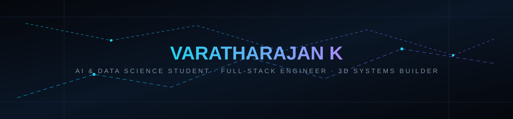

<div align="center">




<a href="https://varatharajan-tech.vercel.app/">
  
</a>
<a href="https://www.linkedin.com/in/varatharajan-k/">
  
</a>
<a href="mailto:varatharajan599v@gmail.com">
  
</a>
<a href="https://github.com/varatharajan-tech">
  
</a>

<br/><br/>


</div>


## 🧭 About Me

```
┌──────────────────────────────────────────────────┐
│  ROLE        AI & Data Science Student (2024–28)  │
│  BUILDING    Full-stack web products               │
│  EXPLORING   3D / interactive systems (Three.js)    │
│  LEARNING    Machine learning & data analysis       │
│  DIRECTION   Toward applied AI engineering           │
│  BASE        Coimbatore, India                      │
└──────────────────────────────────────────────────┘
```

I'm a B.Tech Artificial Intelligence & Data Science student at RVS Technical Campus. My shipped work so far sits at the intersection of **full-stack development** and **interactive/3D systems** — a car configurator built with Three.js, an exam platform with an AI-assisted proctoring concept, and a research-paper automation tool. I'm early in my machine learning journey and actively building toward AI engineering — this profile will grow that section as real ML/AI-backed projects ship, rather than claiming that stack before it's demonstrated.


## ⚡ Currently Building

- 🧠 Strengthening machine learning & data analysis fundamentals in Python
- 🌐 Shipping full-stack products (React / TypeScript, Next.js + Firebase)
- 🎮 Deepening 3D/interactive work with Three.js & React Three Fiber
- 🔁 Working to move AI-themed project concepts toward real model-backed functionality


## 🧩 Tech Stack

<table>
<tr>
<td valign="top" width="50%">

**Languages**
<br/>


**Frontend**
<br/>


</td>
<td valign="top" width="50%">

**Backend & Data**
<br/>


**Tools & Deployment**
<br/>


</td>
</tr>
</table>

> **AI/ML:** Python-based machine learning & data analysis fundamentals — learning stage, applied conceptually in project UI (proctoring logic, formatting automation). This section expands as model-backed work ships publicly.


## 🚀 Featured Projects

<table>
<tr>
<td width="50%" valign="top">

### 🚗 amazing-car-website
Interactive 3D car showroom & configurator — rotate, zoom, and customize color/style in real time.

`React` `TypeScript` `Three.js` `React Three Fiber` `Tailwind` `Supabase`

[Code](https://github.com/varatharajan-tech/amazing-car-website) · [Live](https://amazing-car-website.netlify.app/)

</td>
<td width="50%" valign="top">

### 📝 Exam-Access-pro
Online examination platform concept with a real-time admin dashboard and AI-assisted proctoring signals (webcam/motion-based).

`Next.js` `Firebase` `Tailwind`

[Code](https://github.com/varatharajan-tech/Exam-Access-pro) · [Live](https://examaccesspro.netlify.app/)

</td>
</tr>
<tr>
<td width="50%" valign="top">

### 🍽️ FOOD-LINK
Platform connecting restaurants, hotels, and households with NGOs to redistribute surplus food in real time.

`HTML5` `CSS3` `JavaScript`

[Code](https://github.com/varatharajan-tech/FOOD-LINK) · [Live](https://sharemealx.netlify.app/)

</td>
<td width="50%" valign="top">

### 📄 research-paper-assistant
Automates research paper formatting (APA/MLA/Chicago) and suggests suitable journals for submission.

`HTML` `CSS` `JavaScript`

[Code](https://github.com/varatharajan-tech/research-paper-assistant)

</td>
</tr>
<tr>
<td width="50%" valign="top">

### 🎟️ EMPIREX-2K26
Responsive event registration website built for the EMPIREX 2026 event.

`React` `Vite` `TypeScript` `Tailwind`

[Code](https://github.com/varatharajan-tech/EMPIREX-2K26) · [Live](https://empirex-2k26.vercel.app/)

</td>
<td width="50%" valign="top">

### 🧪 More on GitHub
6 pinned projects shown here — explore the full repository list for additional work.

[View all repositories →](https://github.com/varatharajan-tech?tab=repositories)

</td>
</tr>
</table>


## 🛤️ Journey So Far

```
2024   B.Tech in AI & Data Science begins
  │
  ▼
Python & data analysis fundamentals
  │
  ▼
Full-stack web development (React, TypeScript, Next.js)
  │
  ▼
3D & interactive systems (Three.js, React Three Fiber)
  │
  ▼
AI-assisted product concepts (proctoring, formatting automation)
  │
  ▼
Next: applied machine learning & AI-engineering projects
```


## 📊 GitHub Analytics

<div align="center">


</div>

### Contribution Snake

<picture>
  <source media="(prefers-color-scheme: dark)" srcset="https://raw.githubusercontent.com/varatharajan-tech/varatharajan-tech/output/github-contribution-grid-snake-dark.svg" />
  
</picture>

> Renders once the snake workflow (Part 3) has run at least once on your repo.


## 📈 Profile Snapshot

<div align="center">


</div>


## 🌐 Connect

<div align="center">

<a href="https://varatharajan-tech.vercel.app/">🌐 Portfolio</a> ·
<a href="https://www.linkedin.com/in/varatharajan-k/">💼 LinkedIn</a> ·
<a href="https://github.com/varatharajan-tech">💻 GitHub</a> ·
<a href="mailto:varatharajan599v@gmail.com">📧 Email</a>

</div>


<div align="center">
<sub>Building in public — one system at a time.</sub>
</div>
